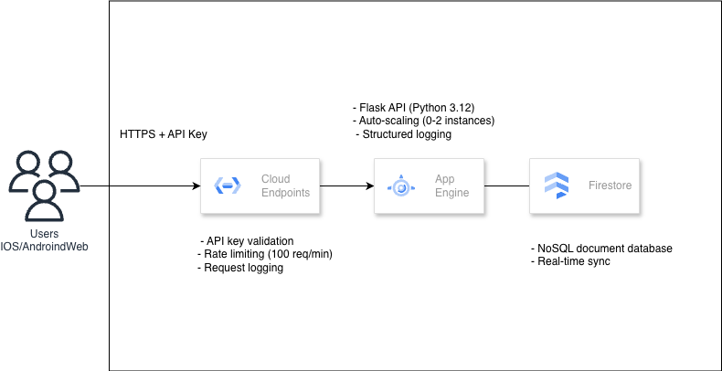

# GCP Cloud Endpoints + App Engine: Mobile API

Production-ready Mobile API backend using Cloud Endpoints, App Engine, and Firestore. Includes API key authentication, rate limiting, structured logging, and auto-scaling.

> **Duration**: ~45 minutes  
> **Level**: Intermediate  
> **Cost**: < $1 (free tier eligible)

## Architecture



## Prerequisites

- GCP account with billing enabled
- `gcloud` CLI installed
- Python 3.12+

## Steps

### 1. Setup (5 mins)

```bash
git clone https://github.com/misskecupbung/gcp-cloud-endpoints-mobile-api.git
cd gcp-cloud-endpoints-mobile-api

export PROJECT_ID="your-project-id"
gcloud config set project $PROJECT_ID

./scripts/setup.sh
```

### 2. Review the Code (5 mins)

The Flask API is in `app/main.py`:

- `GET /api/v1/users` - List users
- `POST /api/v1/users` - Create user
- `GET /api/v1/users/{id}` - Get user
- `PUT /api/v1/users/{id}` - Update user
- `DELETE /api/v1/users/{id}` - Delete user
- `GET /api/v1/health` - Health check

### 3. Configure OpenAPI (5 mins)

Update the host in `openapi.yaml`:

```bash
sed -i "s/YOUR_PROJECT_ID/$(gcloud config get-value project)/g" openapi.yaml
```

### 4. Deploy (10 mins)

```bash
./scripts/deploy.sh
```

### 5. Test the API (10 mins)

```bash
./scripts/test-api.sh
```

Or manually:

```bash
export API_HOST="https://$PROJECT_ID.appspot.com"
export API_KEY=$(gcloud services api-keys list --format="value(name)" | head -1 | xargs gcloud services api-keys get-key-string --format="value(keyString)")

# Health check (no auth)
curl "$API_HOST/api/v1/health"

# Create user
curl -X POST "$API_HOST/api/v1/users?key=$API_KEY" \
  -H "Content-Type: application/json" \
  -d '{"name": "John", "email": "john@example.com"}'

# List users
curl "$API_HOST/api/v1/users?key=$API_KEY"
```

### 6. Monitor (5 mins)

Check [Cloud Console > Endpoints](https://console.cloud.google.com/endpoints) for request metrics, latency, and error rates.

### 7. Test Rate Limiting (5 mins)

```bash
./scripts/test-rate-limit.sh
```

## Project Structure

```
├── app/
│   ├── main.py              # Flask API
│   ├── requirements.txt
│   └── app.yaml.template
├── openapi.yaml             # Cloud Endpoints spec
├── scripts/
│   ├── setup.sh
│   ├── deploy.sh
│   ├── test-api.sh
│   ├── test-rate-limit.sh
│   └── cleanup.sh
└── postman/
    └── collection.json
```

## Cleanup

```bash
./scripts/cleanup.sh
```

---

## Features

- Cloud Firestore database
- API key authentication
- Rate limiting (100 req/min)
- Auto-scaling (0 to N instances)
- Structured logging (Cloud Logging)
- Security headers
- Input validation
- Health checks with DB status

## Troubleshooting

### "App Engine application does not exist"

```bash
gcloud app create --region=us-central
```

### "API key not valid"

```bash
# List existing keys
gcloud services api-keys list

# Create new key
gcloud services api-keys create --display-name="mobile-api-key"

# Get key string
KEY_NAME=$(gcloud services api-keys list --format="value(name)" | head -1)
gcloud services api-keys get-key-string $KEY_NAME
```

### "Permission denied"

```bash
gcloud auth login
gcloud config set project $PROJECT_ID
```

### Rate limits not working

Redeploy the OpenAPI spec:

```bash
gcloud endpoints services deploy openapi.yaml
```

### CORS errors

Check `openapi.yaml` has:

```yaml
x-google-endpoints:
  - name: "project-id.appspot.com"
    allowCors: true
```

### Debug Commands

```bash
# View logs
gcloud app logs tail -s default

# Check endpoints status
gcloud endpoints services describe $PROJECT_ID.appspot.com

# List app versions
gcloud app versions list
```

## Additional Resources

- [Cloud Endpoints Documentation](https://cloud.google.com/endpoints/docs)
- [App Engine Standard Documentation](https://cloud.google.com/appengine/docs/standard/python3)
- [Cloud Firestore Documentation](https://cloud.google.com/firestore/docs)
- [OpenAPI Specification](https://swagger.io/specification/v2/)

## License

This project is licensed under the MIT License - see the [LICENSE](LICENSE) file for details.
